# Part 1: Post-Synthesis Gate-Level Simulation (GLS)

## Objective

This part focuses on performing Gate-Level Simulation (GLS) for the
VSDBabySoC design using the synthesized netlist. The goal is to verify
that the GLS results match the functional simulation outputs obtained in
Week 2.

------------------------------------------------------------------------

## What is Gate-Level Simulation (GLS)?

Gate-Level Simulation (GLS) is a verification step where the synthesized
netlist (composed of logic gates and flip-flops) is simulated to verify
that it behaves identically to the RTL-level functional simulation.

GLS helps ensure:

-   **Correctness of synthesis output.**
-   **Detection of timing or logic issues introduced during synthesis.**
-   **Validation of reset logic, clock propagation, and signal
    integrity.**

------------------------------------------------------------------------

## Why Do We Need GLS?

### 1. Verification of Logic Equivalence:

Ensures that the design post-synthesis behaves the same as the RTL
design.

### 2. Timing Verification:

Helps catch timing-related glitches or X-propagation issues that may not
appear in RTL simulation.

### 3. Confidence for Tapeout:

Ensures the synthesized netlist is functionally correct before
proceeding to layout or STA stages.

------------------------------------------------------------------------

## How to Perform Gate-Level Simulation

The GLS process involves these main steps:

### **Step 1: Load the Top-Level Design and Supporting Modules**

Inside the Yosys shell, run:

``` bash
read_verilog ./src/module/vsdbabysoc.v
read_verilog -I ./src/include ./output/compiled_tlv/rvmyth.v
read_verilog -I ./src/include ./src/module/clk_gate.v
read_verilog
```

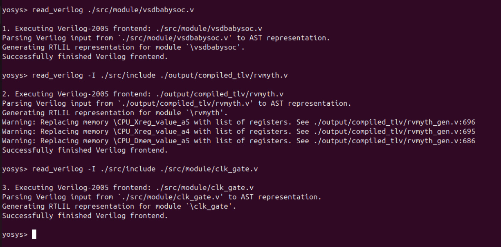

### **Step 2: Load the Liberty Files for Synthesis**

Inside the same Yosys shell, run:

``` bash
read_liberty -lib src/lib/avsdpll.lib
read_liberty -lib src/lib/avsddac.lib
read_liberty -lib src/lib/sky130_fd_sc_hd__tt_025C_1v80.lib
read_constraints
```

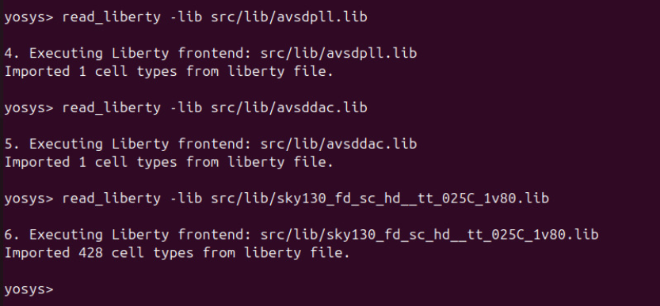

### **Step 3: Run Synthesis Targeting vsdbabysoc**

``` bash
synth -top vsdbabysoc

```
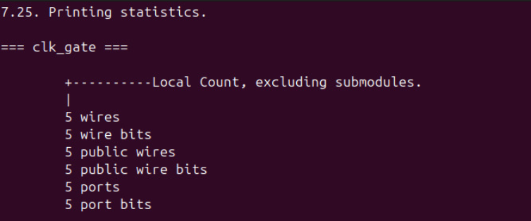
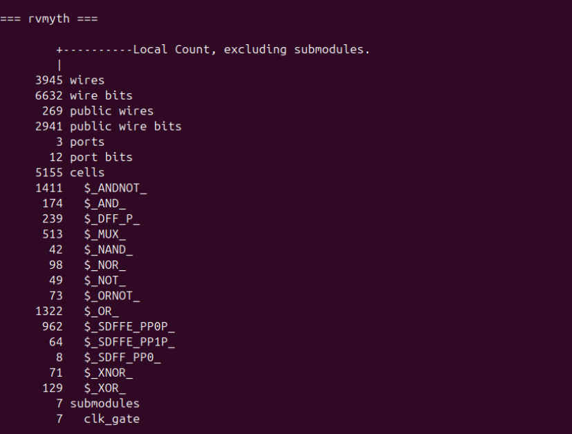
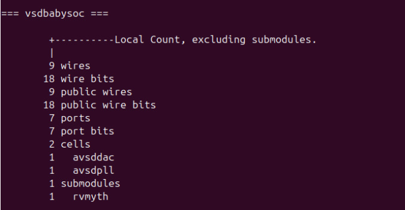
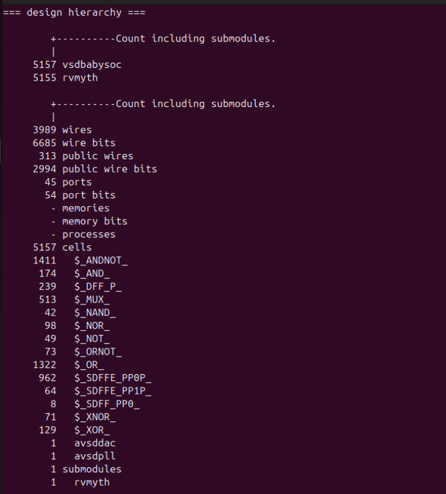

### **Step 4: Map D Flip-Flops to Standard Cells**

``` bash
dfflibmap -liberty /home/ananya123/VSDBabySoCC/VSDBabySoC/src/lib/sky130_fd_sc_hd__tt_025C_1v80.lib
```

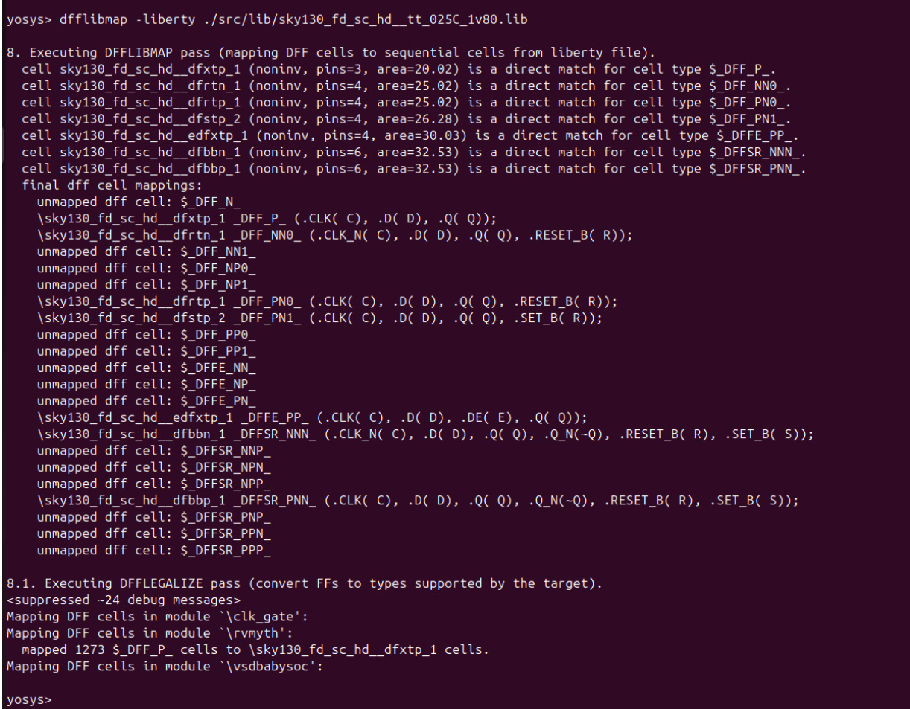

### **Step 5: Perform Optimization and Technology Mapping**

``` bash
opt
abc -liberty ./src/lib/sky130_fd_sc_hd__tt_025C_1v80.lib
```
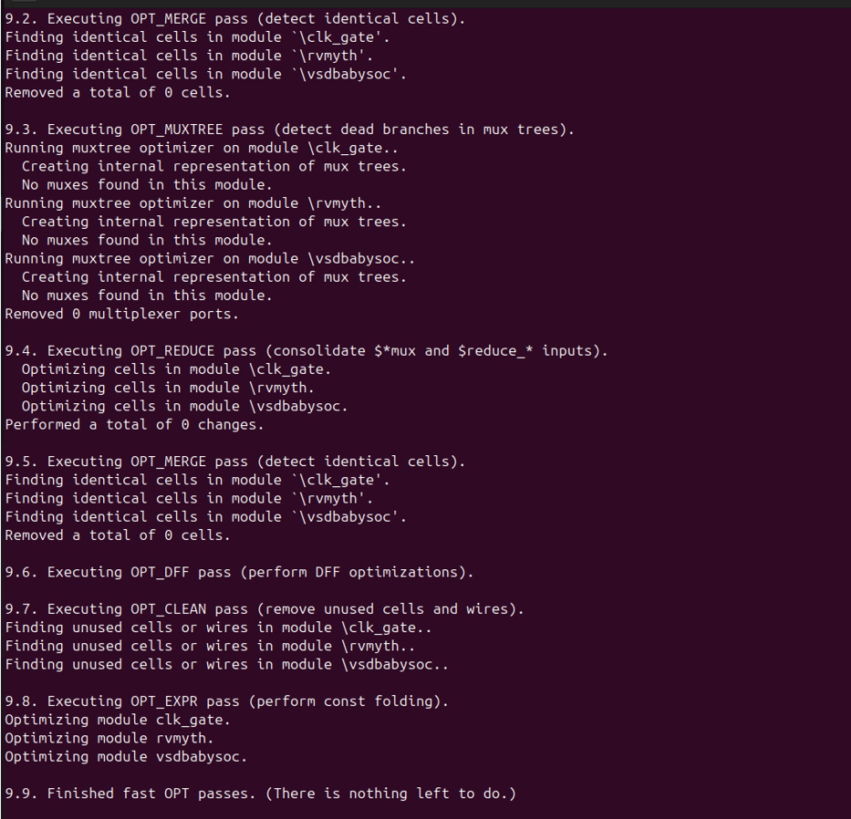
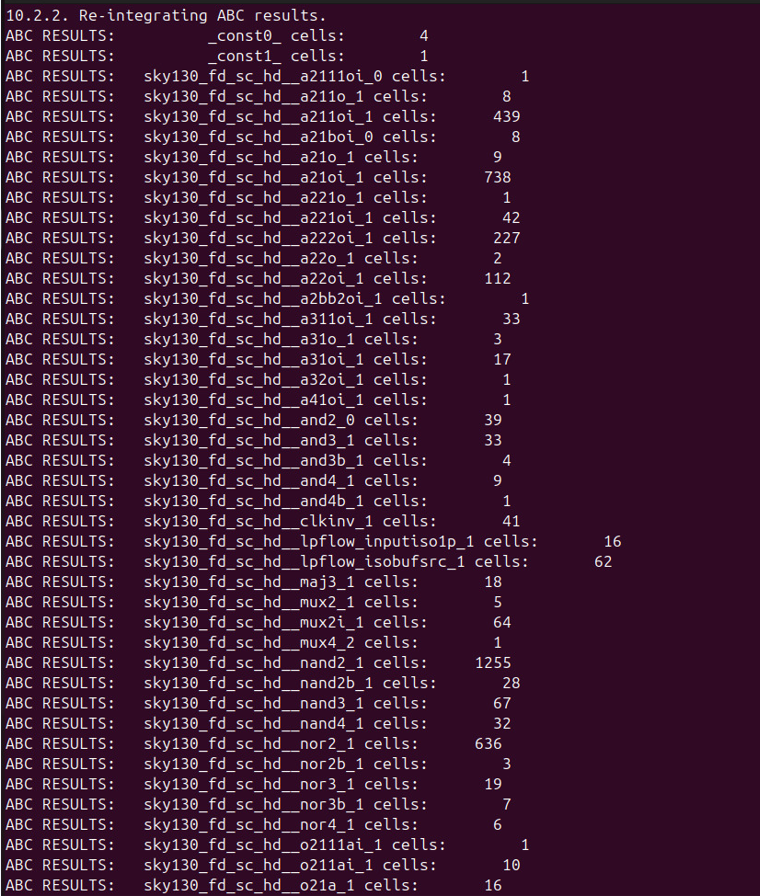
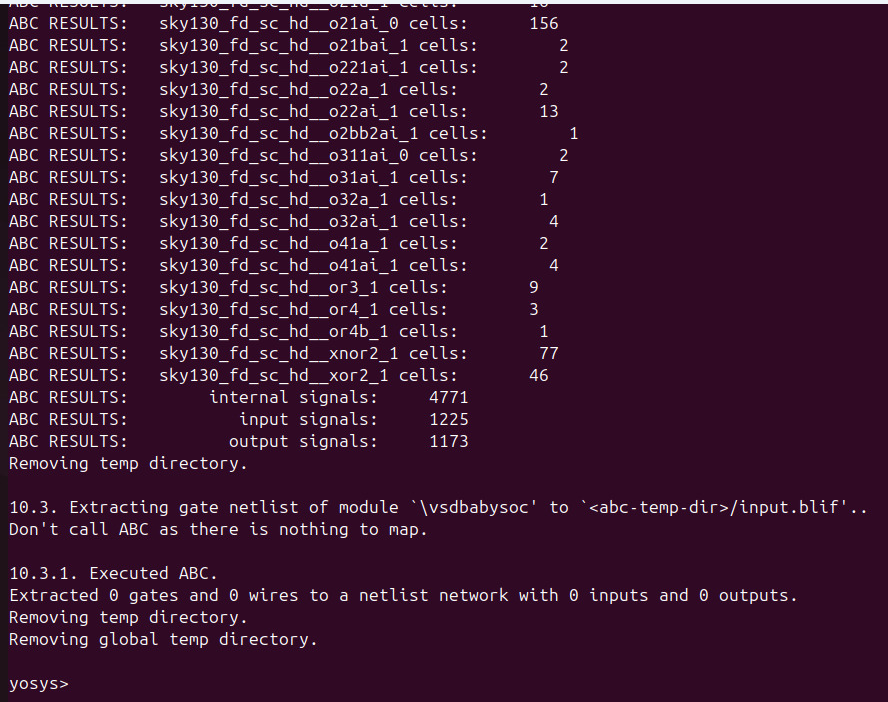

### **Step 6: Perform Final Clean-Up and Renaming**

``` bash
flatten
setundef -zero
clean -purge
rename -enumerate
```

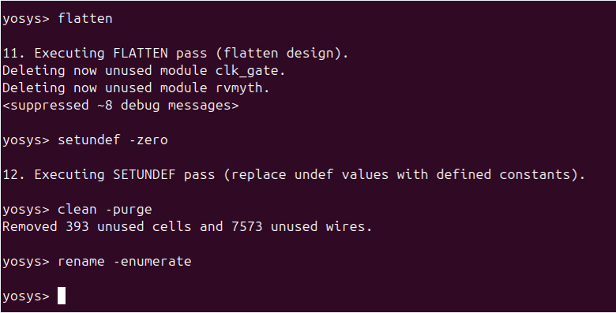

### **Step 7: Check Statistics**

``` bash
stat
```

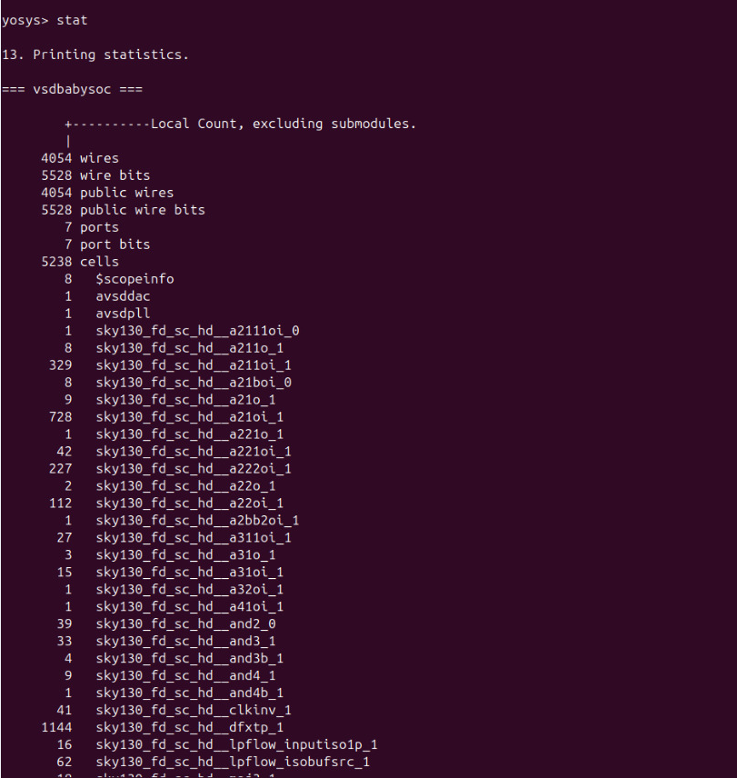
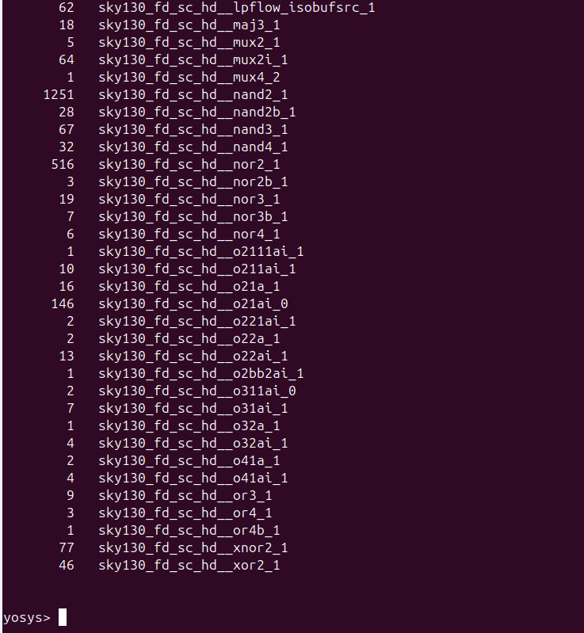

### **Step 8: Write the Synthesized Netlist**

``` bash
write_verilog -noattr ./output/post_synth_sim/vsdbabysoc.synth.v
```

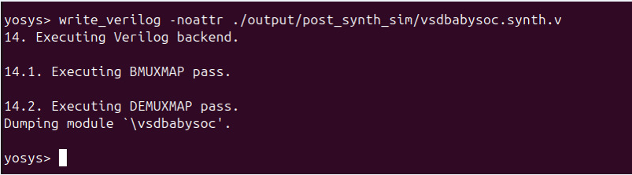

------------------------------------------------------------------------

## Post-Synthesis Simulation

### **Step 1: Compile the Testbench**

Run the following iverilog command to compile the testbench:

``` bash
iverilog -o /home/ananya123/VSDBabySoCC/VSDBabySoC/output/post_synth_sim/post_synth_sim.out -DPOST_SYNTH_SIM -DFUNCTIONAL -DUNIT_DELAY=#1 -I ./src/include -I ./src/module -I ./src/gls_model .src/module/testbench.v .output/post_synth_sim/vsdbabysoc.synth.v
```

### **Step 2: Navigate to the Post-Synthesis Simulation Output Directory**

``` bash
cd output/post_synth_sim/
```

### **Step 3: Run the Simulation**

``` bash
./post_synth_sim.out
```

### **Step 4: View the Waveforms in GTKWave**

``` bash
gtkwave post_synth_sim.vcd
```

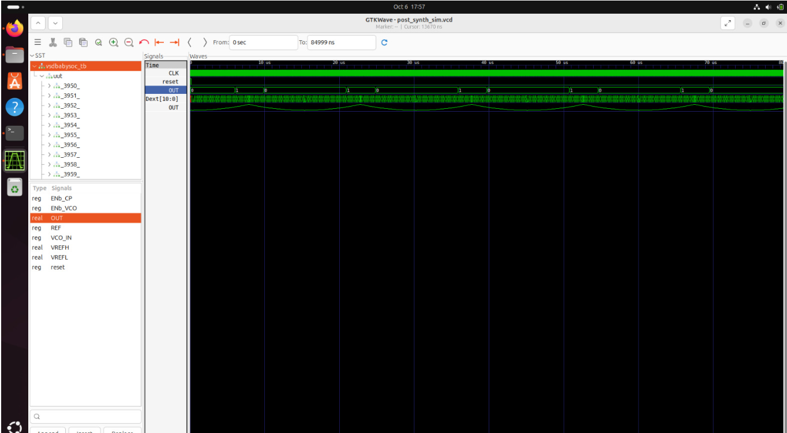

------------------------------------------------------------------------

## Final Observation

The Gate-Level Simulation (GLS) results were found to be functionally
equivalent to the RTL simulation results obtained in Week 2. This
confirms that synthesis did not introduce any unintended logic changes.

**Conclusion:** GLS output = Functional Simulation output
