# Timing Analysis of VSDBabySoc
---
## Steps to do Timing analysis of VSDBabySoC

```bash
cd Desktop/SoC/VSDBabySoC
sta

# Load Liberty Libraries (standard cell + IPs)
read_liberty  ./src/lib/sky130_fd_sc_hd__tt_025C_1v80.lib
read_liberty  ./src/lib/avsdpll.lib
read_liberty ./src/lib/avsddac.lib

# Read Synthesized Netlist
read_verilog ./src/module/vsdbabysoc.synth.v

# Link the Top-Level Design
link_design vsdbabysoc

# Apply SDC Constraints
read_sdc ./src/sdc/vsdbabysoc_synthesis.sdc
 
#SDC Constraints
set_units -time ns
create_clock [get_pins {pll/CLK}] -name clk -period 11

# Generate Timing Report (by default max path)
report_checks

# Generate Timing Report for min path
report_checks -path_delay min
```
**Screenshot**: Terminal Output
 
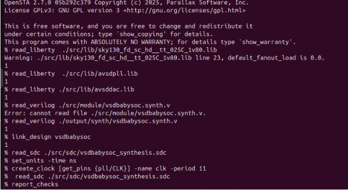

---
**Screenshot**: VSDBabySoC Timing report for max path
 
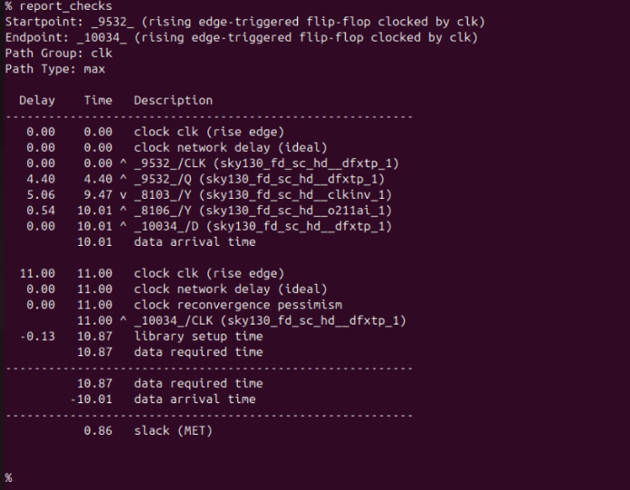

---
**Screenshot**: VSDBabySoC Timing report for min path
 
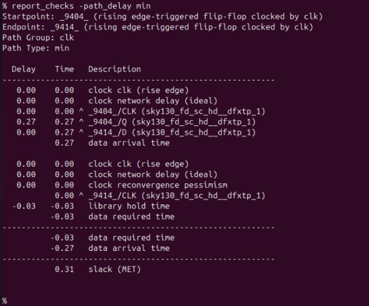

---
# Multi-PVT Corner Timing Analysis of VSDBabySoC using OpenSTA
---
## Multi-PVT Corners in STA

**Definition:**  
In **Static Timing Analysis (STA)**, **Multi-PVT Corners** refer to evaluating the design under multiple combinations of **Process, Voltage, and Temperature (PVT)** conditions. These corners help ensure that the design **meets timing constraints across all expected operating conditions**.

### Components of PVT:

1. **Process (P):**  
   - Variations in manufacturing, e.g., **slow (SS), typical (TT), fast (FF)** transistors.
   - Accounts for **chip-to-chip variability**.

2. **Voltage (V):**  
   - Variations in supply voltage, e.g., **nominal, high, low**.
   - Ensures timing is robust against **power supply fluctuations**.

3. **Temperature (T):**  
   - Variations in operating temperature, e.g., **-40°C, 25°C, 125°C**.
   - Models the effect of **thermal conditions** on transistor speed.

### Purpose of Multi-PVT Corners:

- STA at a **single corner** is insufficient for real-world conditions.  
- Multi-PVT analysis ensures the **design meets timing and functional requirements** under all expected scenarios:  
  - **Fast Process + High Voltage + Low Temperature** → fastest circuits, check **hold violations**.  
  - **Slow Process + Low Voltage + High Temperature** → slowest circuits, check **setup violations**.  

  **Example Scenarios:**

- **Fast Corner:** FF transistors at **-40 °C, 1.95 V** → circuits are faster; checks **hold violations** (data may arrive too early).  
- **Slow Corner:** SS transistors at **100 °C, 1.40 V** → circuits are slower; checks **setup violations** (data may arrive too late). 
---
## Timing Libraries for Multi-PVT Analysis

The timing libraries required for this analysis can be downloaded from the **SkyWater PDK**:

- **SkyWater PDK – sky130_fd_sc_hd Timing Libraries**  
  - These libraries provide **process-, voltage-, and temperature-specific timing models** needed for accurate STA.  
  - You can download them from the official [SkyWater PDK repository](https://github.com/google/skywater-pdk) or the timing library package link provided by the PDK.
---
 
## Using the Multi-PVT TCL Script for STA

We are going to use the `multi_pvt_corners.tcl` script to **automate Static Timing Analysis (STA) across multiple PVT corners**. This allows us to verify that the design meets timing constraints under all **process, voltage, and temperature conditions** without manually switching libraries or rerunning analyses.

### Steps Performed by the Script:

1. **Load PVT-specific timing libraries**  
   - Example: `sky130_fd_sc_hd__ss_100C_1v40.lib` for a **slow-slow, high-temperature, low-voltage** corner.  

2. **Link the synthesized netlist**  
   - Ensures the same RTL design is used for all corners.  

3. **Apply SDC constraints**  
   - Clocks, input/output delays, and timing exceptions are applied consistently for each corner.  

4. **Run timing checks**  
   - Includes **setup, hold, worst negative slack (WNS), total negative slack (TNS)** for each corner.  

5. **Save detailed reports**  
   - Generates a **separate report for each PVT corner** under `./sta_outputs/` for analysis.  

### Benefits:

- Provides **comprehensive timing validation** across all operating conditions.  
- Automates repetitive STA tasks, saving **time and effort**.  
- Identifies **worst-case paths** for setup and hold, ensuring reliable chip operation.  

---

## Script to run Static Timing Analysis for all corners

```bash
#---------------------------------------------
#  Multi-corner STA Automation Script (OpenSTA)
#---------------------------------------------

# Define list of timing libraries (corners)
set list_of_lib_files {
    sky130_fd_sc_hd__ff_n40C_1v95.lib
    sky130_fd_sc_hd__ff_100C_1v65.lib
    sky130_fd_sc_hd__ff_100C_1v95.lib
    sky130_fd_sc_hd__ff_n40C_1v56.lib
    sky130_fd_sc_hd__ff_n40C_1v65.lib
    sky130_fd_sc_hd__ff_n40C_1v76.lib
    sky130_fd_sc_hd__ss_100C_1v40.lib
    sky130_fd_sc_hd__ss_100C_1v60.lib
    sky130_fd_sc_hd__ss_n40C_1v28.lib
    sky130_fd_sc_hd__ss_n40C_1v35.lib
    sky130_fd_sc_hd__ss_n40C_1v40.lib
    sky130_fd_sc_hd__ss_n40C_1v44.lib
    sky130_fd_sc_hd__ss_n40C_1v76.lib
    sky130_fd_sc_hd__ss_n40C_1v60.lib
    sky130_fd_sc_hd__tt_025C_1v80.lib
    sky130_fd_sc_hd__tt_100C_1v80.lib
}

#---------------------------------------------
#  Load base cell libraries and design files
#---------------------------------------------
read_liberty ./src/lib/avsdpll.lib
read_liberty ./src/lib/avsddac.lib

#---------------------------------------------
#  Create output folder
#---------------------------------------------
file mkdir sta_outputs

#---------------------------------------------
#  Loop through each .lib file (corner)
#---------------------------------------------
set i 1
foreach lib_file $list_of_lib_files {

    puts "\n=== Running STA for corner: $lib_file ==="

    # Load corner-specific library
    read_liberty ./src/lib/$lib_file

    # Read design and constraints
    read_verilog ./src/module/vsdbabysoc.synth.v
    link_design vsdbabysoc
    current_design vsdbabysoc
    read_sdc ./src/sdc/updated_synth.sdc

    # Perform timing checks
    check_setup -verbose

    #-----------------------------------------
    # Generate detailed reports
    #-----------------------------------------
    report_checks \
        -path_delay min_max \
        -fields {nets cap slew input_pins fanout} \
        -digits 4 \
        > ./sta_outputs/min_max_$lib_file.txt

    #-----------------------------------------
    # Save key metrics (WNS, TNS)
    #-----------------------------------------
    exec echo "$lib_file" >> ./sta_outputs/sta_worst_max_slack.txt
    report_worst_slack -max -digits 4 >> ./sta_outputs/sta_worst_max_slack.txt

    exec echo "$lib_file" >> ./sta_outputs/sta_worst_min_slack.txt
    report_worst_slack -min -digits 4 >> ./sta_outputs/sta_worst_min_slack.txt

    exec echo "$lib_file" >> ./sta_outputs/sta_tns.txt
    report_tns -digits 4 >> ./sta_outputs/sta_tns.txt

    exec echo "$lib_file" >> ./sta_outputs/sta_wns.txt
    report_wns -digits 4 >> ./sta_outputs/sta_wns.txt

    incr i
}
puts "\n All corners analysed. Reports saved in ./sta_outputs/"
``` 
---
## SDC Constraints For VSDBabySoC

```bash
# =============================================================================
# SDC Constraints for vsdbabysoc Module (synthesised netlist)
# Generated for OpenSTA Static Timing Analysis
# Clock period: 11 ns (~90.9 MHz)
# =============================================================================

set_units -time ns

# Clock definition
create_clock -name clk -period 11 [get_pins pll/CLK]

set_clock_latency -source 2 [get_clocks clk]
set_clock_latency 1 [get_clocks clk]
set_clock_uncertainty -setup 0.5 [get_clocks clk]
set_clock_uncertainty -hold 0.5 [get_clocks clk]

# Design constraints
set_max_area 8000
set_max_fanout 5 vsdbabysoc
set_max_transition 10 vsdbabysoc

# Input constraints
set_input_delay -clock clk -max 4 [get_ports {reset VCO_IN ENb_CP ENb_VCO REF VREFH}]
set_input_delay -clock clk -min 1 [get_ports {reset VCO_IN ENb_CP ENb_VCO REF VREFH}]
set_input_transition -max 0.4 [get_ports {reset VCO_IN ENb_CP ENb_VCO REF VREFH}]
set_input_transition -min 0.1 [get_ports {reset VCO_IN ENb_CP ENb_VCO REF VREFH}]

# Output constraints
set_load -max 0.5 [get_ports OUT]
set_load -min 0.5 [get_ports OUT]
set_output_delay -clock clk -max 0.5 -clock clk [get_ports OUT]
set_output_delay -clock clk -min 0.5 -clock clk [get_ports OUT]

# Path delay
set_max_delay 10 -from [get_clocks clk] -to [get_ports OUT]
```
## How to run Multi-PVT corner analysis
```bash
# Go to OpenSTA interactive shell (denoted by %)
sta

source multi_pvt_corners.tcl
```
---
## STA Output
- After successfull analysis of `multi pvt corners`, it produces 4 output files.
They are.
```bash
sta_tns.txt
sta_wns.txt
sta_worst_max_slack.txt
sta_worst_min_slack.txt
```
**Screenshot of sta_worst_max_slack.txt**

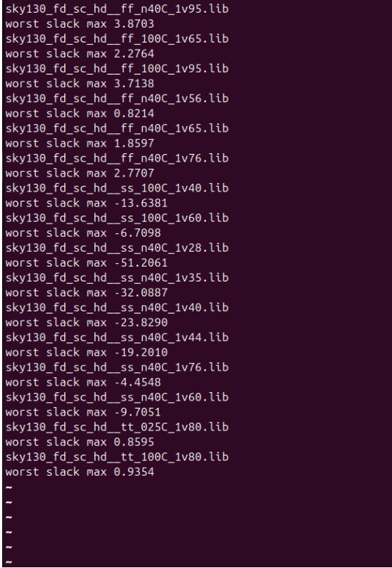

---
**Screenshot of sta_worst_min_slack.txt**

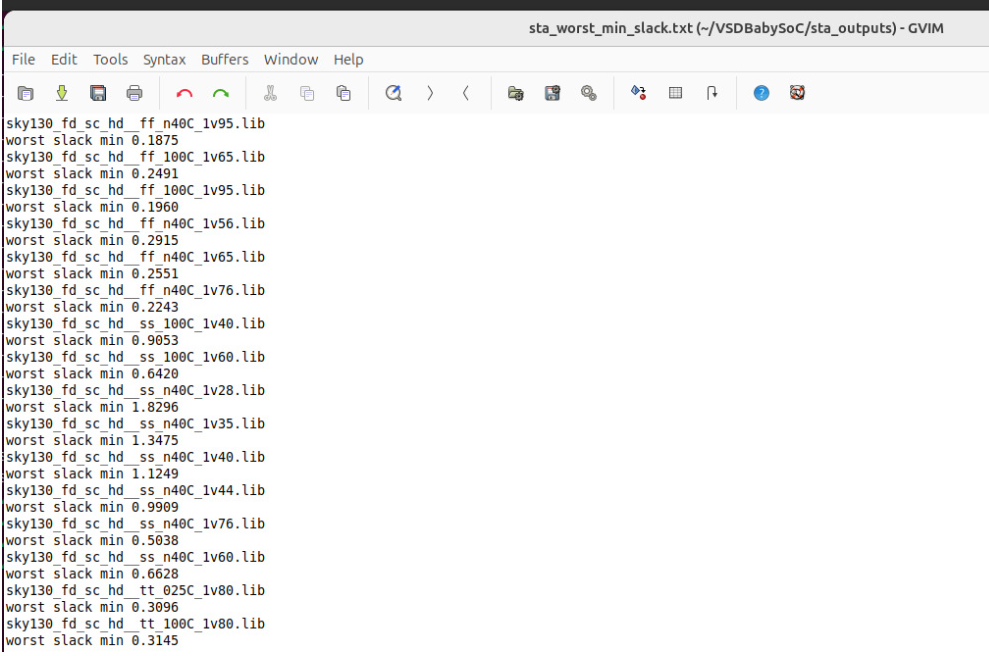

---
**Screenshot of sta_wns.txt**

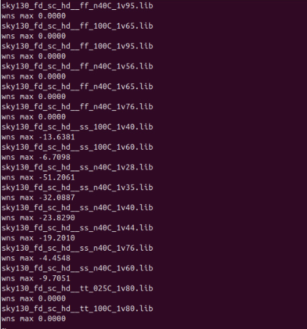

---
**Screenshot of sta_tns.txt**

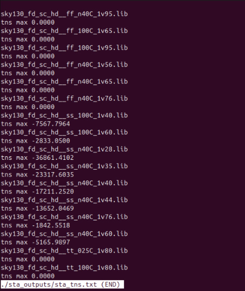

---
# Multi-PVT Timing Summary Report

This report summarises the **setup and hold timing performance** across multiple PVT (Process, Voltage, Temperature) corners analysed using **OpenSTA** for the vsdbabysoc design.

---

## Timing Summary Table

| Library Corner     | Max/Worst Max Slack (Setup) | Min/Worst Min Slack (Hold) | WNS          | TNS          | Observation                     |
|-------------------|-----------------------------|----------------------------|--------------|--------------|--------------------------------|
| ff_n40C_1v95      | 🟩 +3.8703                  | 🟩 +0.1875                 | 🟩 0.0000    | 🟩 0.0000    | Strong setup, hold OK          |
| ff_100C_1v65      | 🟩 +2.2764                  | 🟩 +0.2491                 | 🟩 0.0000    | 🟩 0.0000    | Setup OK, hold OK              |
| ff_100C_1v95      | 🟩 +3.7138                  | 🟩 +0.1960                 | 🟩 0.0000    | 🟩 0.0000    | Excellent setup, hold OK       |
| ff_n40C_1v56      | 🟩 +0.8214                  | 🟩 +0.2915                 | 🟩 0.0000    | 🟩 0.0000    | OK setup, good hold margin     |
| ff_n40C_1v65      | 🟩 +1.8597                  | 🟩 +0.2551                 | 🟩 0.0000    | 🟩 0.0000    | Setup good, hold OK            |
| ff_n40C_1v76      | 🟩 +2.7707                  | 🟩 +0.2243                 | 🟩 0.0000    | 🟩 0.0000    | Fast corner stable             |
| ss_100C_1v40      | 🟥 −13.6381                 | 🟩 +0.9053                 | 🟥 −13.6381  | 🟥 Large     | Major setup fail               |
| ss_100C_1v60      | 🟥 −6.7098                  | 🟩 +0.6420                 | 🟥 −6.7098   | 🟥 Large     | Setup fail                     |
| ss_n40C_1v28      | 🟥 −51.2061                 | 🟩 +1.8296                 | 🟥 −51.2061  | 🟥 Severe    | Severe setup fail              |
| ss_n40C_1v35      | 🟥 −32.0887                 | 🟩 +1.3475                 | 🟥 −32.0887  | 🟥 Large     | Setup fail                     |
| ss_n40C_1v40      | 🟥 −23.8290                 | 🟩 +1.1249                 | 🟥 −23.8290  | 🟥 Large     | Setup fail                     |
| ss_n40C_1v44      | 🟥 −19.2010                 | 🟩 +0.9909                 | 🟥 −19.2010  | 🟥 Large     | Setup fail                     |
| ss_n40C_1v76      | 🟥 −4.4548                  | 🟩 +0.5038                 | 🟥 −4.4548   | 🟥 Large     | Setup fail                     |
| ss_n40C_1v60      | 🟥 −9.7051                  | 🟩 +0.6628                 | 🟥 −9.7051   | 🟥 Large     | Setup fail                     |
| tt_025C_1v80      | 🟩 +0.8595                  | 🟩 +0.3096                 | 🟩 0.0000    | 🟩 0.0000    | Typical corner OK              |
| tt_100C_1v80      | 🟩 +0.9354                  | 🟩 +0.3145                 | 🟩 0.0000    | 🟩 0.0000    | Typical-hot OK                 |

---

### Legend

| Symbol | Meaning                 | Description                               |
|:------:|:-----------------------|:-----------------------------------------|
| 🟩     | PASS                    | Slack ≥ 0 ns → Meets timing              |
| 🟥     | FAILURE                 | Slack ≤ −1 ns → Fails timing             |

---

### Observations

1. 🟩 **FF (Fast-Fast)** and **TT (Typical-Typical)** corners meet setup & hold comfortably.  
2. 🟩 Hold slacks are positive across all corners — **no hold failures** observed.  
3. 🟥 **SS (Slow-Slow)** corners show significant setup violations due to **low voltage and high temperature**.  
4. 🟩 Classic trade-off observed:  
   - *Fast corners → Hold-critical* (short paths).  
   - *Slow corners → Setup-critical* (long paths).  
5. Worst setup violation at *ss_n40C_1v28* (−51.2061 ns) → severe slowdown under cold/low-voltage.  
6. Indicates need for *path optimization, retiming, or clock relaxation* to close setup timing at slow corners.  

---

### Heatmap 
In STA, a heatmap is used to visualize the timing slack of different paths under various conditions (PVT corners, clock domains, or corners vs cells). Each cell of the heatmap represents the slack of a particular path under a specific corner.

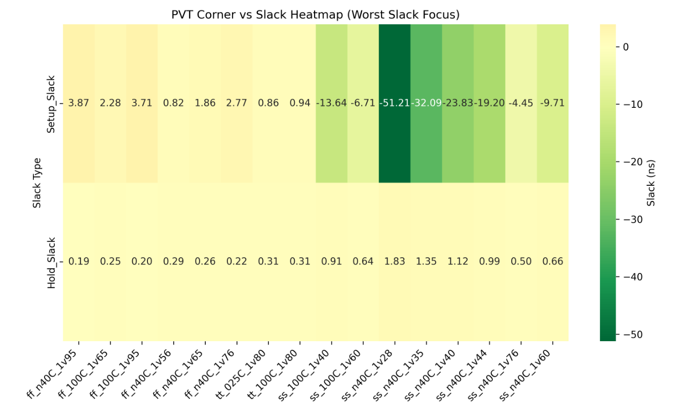

**Inference**
- Green → Worst slack (more negative or closer to violation)
- Light yellow → Best slack (more positive, safe)
---

1. **Worst Max Slack Across corners**

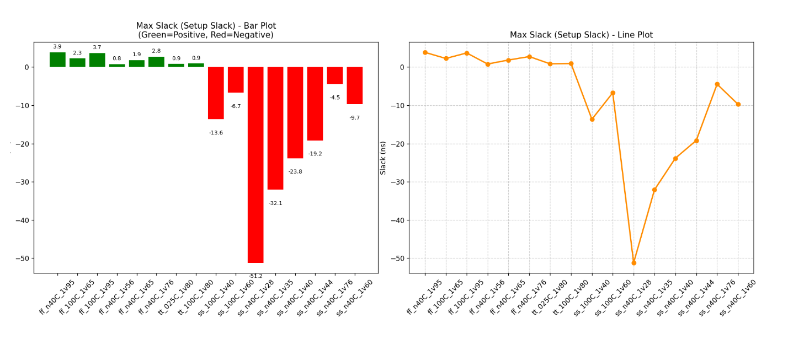

**Observation**
- The Setup Slack values for most corners are positive, indicating timing is met for those corners.
- The worst corner (ss_n40C_1v28) has the maximum setup slack (~-51.21 ns), showing a significant timing violation under the slow-slow (SS) corner at low voltage and low temperature.

---

2. **Worst Min Slack Across Corners**

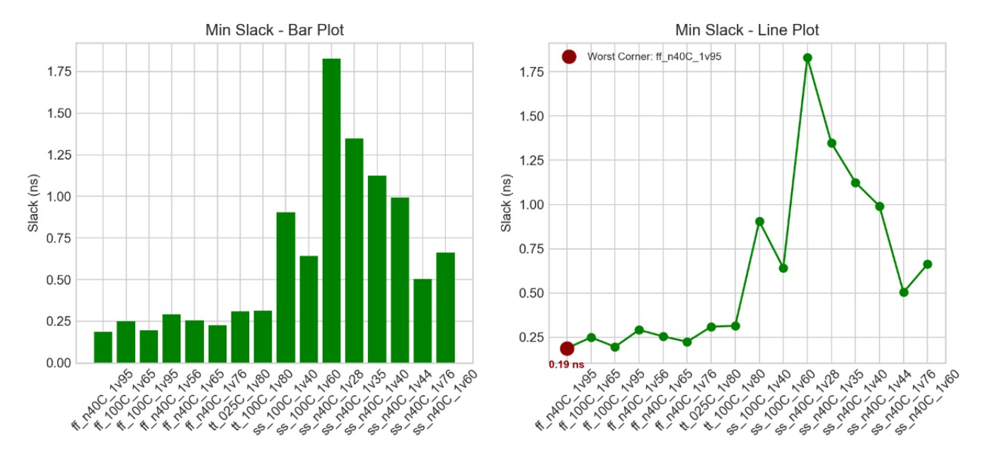

**Observation**
- The Hold Slack values for most corners are positive, indicating no hold violations for those corners.
- The worst corner (ss_n40C_1v28) has the minimum hold slack (~1.83 ns), highlighted in dark red.

---

3. **Worst Negative Slack Across Corners**

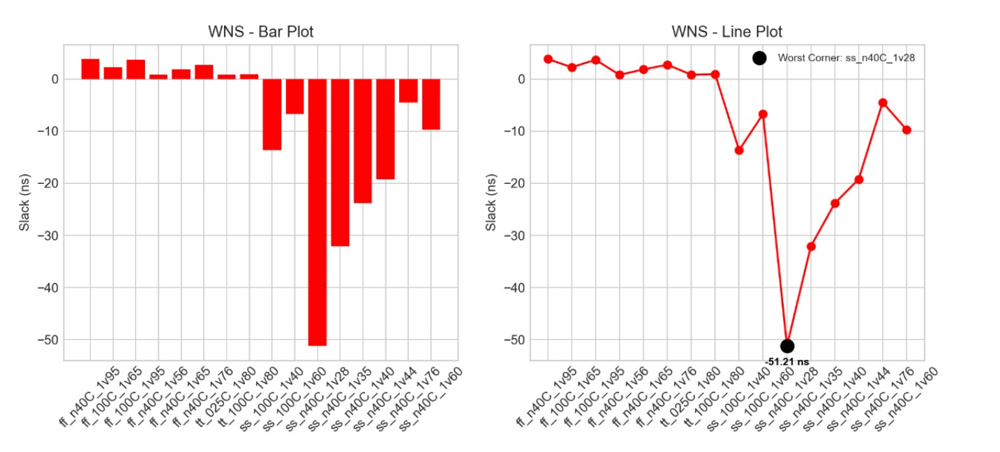

**Observation**
- Some corners have negative setup slack, indicating setup timing violations.
- The worst negative slack (WNS) occurs at ss_n40C_1v28 with -51.21 ns, highlighted in black.
---

4. **Total Negative Slack Across Corners**

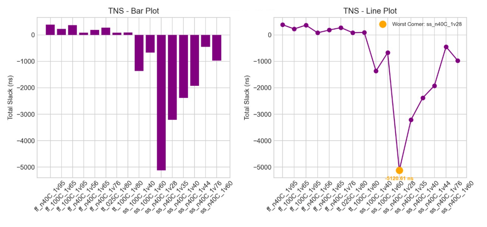

**Observation**
- Total Negative Slack aggregates all negative setup slacks.
- The highest TNS occurs at ss_n40C_1v28, indicating the largest cumulative timing violations.

---
## Inference from Multi PVT Corners slack analysis

- The analysis of hold slack, setup slack, and total negative slack across all process corners reveals that the worst-case timing occurs in the ss_n40C_1v28 corner, with significant setup violations.
- Hold timing is generally safe across corners. The total negative slack highlights cumulative violations, guiding optimization priorities. 
- Focus should be on critical paths in the slowest corners to achieve timing closure and reliable operation.

---
##  Conclusion

- Fast (FF) and Typical (TT) corners meet timing comfortably; setup and hold slacks are positive.
- Slow-Slow (SS) corners, especially ss_n40C_1v28, show severe setup violations, indicating paths are too slow under low voltage and low temperature.
- Hold timing is safe across all corners; no early data capture issues observed.
- Optimization is needed for critical paths in slow corners: retiming, path restructuring, or clock adjustment.
- Overall, the design is robust in typical and fast conditions, but slow corners require attention to ensure reliable operation across all PVT scenarios.
---